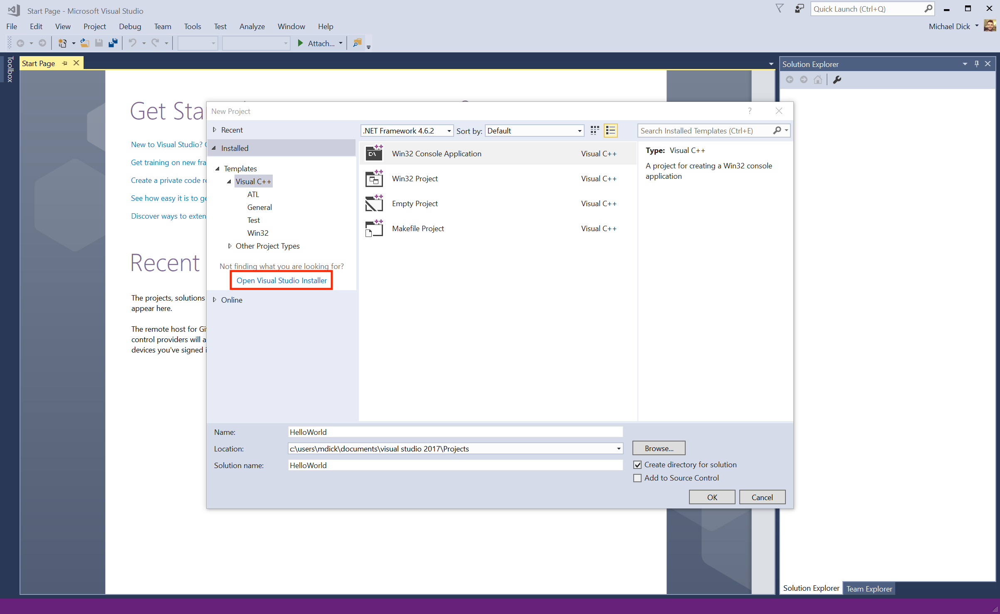
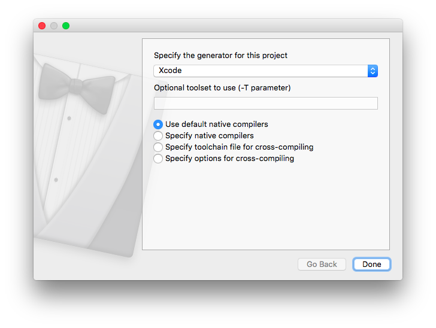

# TW3720TU: INSTALL.md


**Please note that we cannot give any kind of support for installing
software on private laptops. In this case you are on your own.**

---

## Install instructions for the VirtualBox image

The PCs in the computer rooms are running Windows 10 with the
programme Oracle VirtualBox installed. A fully configured VirtualBox
image is located in the directory
`C:\Courses\EWI-TW3720TU\Ubuntu64.ova`.

1.  Open Oracle VirtualBox and click on `Import Appliance` from the
    `File` menu and import `C:\Courses\EWI-TW3720TU\Ubuntu64.ova`.

2.  Start the imported appliance by running `Ubuntu64` via the `start`
    button.

If you want to use VirtualBox together with the preconfigured
[Ubuntu64.ova](https://surfdrive.surf.nl/files/index.php/s/R2H5shGxwZFP0hW)
image on your own laptop computer you can download
[VirtualBox](https://www.virtualbox.org), install it as described
[here](https://www.virtualbox.org/manual/ch02.html) and import the
image as described above.

---

## Install instructions for Windows

1.  Download [Git for Windows](https://git-scm.com/download/win) and
    install it. Open the `Git Bash` program and run the following
    commands:
    ```
    git config --global user.name “Your Name“
    git config --global user.email you@somewhere.nl
    git clone https://gitlab.com/mmoelle1/tw3720tu.2017
    ```

2.  Download [Microsoft Visual Studio Community Edition
    2017](https://www.visualstudio.com/vs/community/) and install it
    following the install instructions that are provided.

3.  The C++ compiler is not installed automatically in Visual Studio
    2017.  To install the C++ compiler, create an `New Project` and
    click on `Open Visual Studio Installer`, as shown in the image
    below:
    
    
    
    A window will appear that shows all of the different kinds of
    `Workloads`. Select `Desktop development with C++` and click on
    `Modify` to install the C++ compiler.
    
    
       
3.  Download [CMake GUI for 64bit
    Windows](https://cmake.org/files/v3.9/cmake-3.9.6-win64-x64.msi) or
    [CMake GUI for 32bit
    Windows](https://cmake.org/files/v3.9/cmake-3.9.6-win32-x86.msi)
    and install it.

4.  Open the `CMake GUI` program specify where you
    downloaded the repository (*Where is the source code:*) and where
    you want the compiled binaries to be stored (*Where to build the
    binaries:*)
    
    
    
    Click on `Configure`. CMake will ask you about the compiler that
    should be used. Select **Visual Studio 2017**.
    
    
    
    Once finished, click on `Generate` to generate a project file in
    the specified build directory.

5.  Open the generated project in Microsoft Visual Studio 2017 by
    clicking on the button `Open Project`.

    You can build individual targets by right-clicking on the project
    in the `Project` menu and chosing `Build`. You can it by chosing
    `Set as StartUpProject` and pressing `Ctrl`+`F5`.

---

## Install instructions for macOS

1.  Install
    [XCode](https://itunes.apple.com/de/app/xcode/id497799835?mt=12)
    from the AppStore. This will provide the `git` command together
    with the C++ compiler.

2.  Open a `Terminal` and run the following commands:
    ```
    git config --global user.name “Your Name“
    git config --global user.email you@somewhere.nl
    git clone https://gitlab.com/mmoelle1/tw3720tu.2017
    ```

3.  Download [CMake GUI for macOS](https://cmake.org/files/v3.9/cmake-3.9.6-Darwin-x86_64.dmg) 
    and install it.

4.  Open the `CMake GUI` program specify where you
    downloaded the repository (*Where is the source code:*) and where
    you want the compiled binaries to be stored (*Where to build the
    binaries:*)
    
    
    
    Click on `Configure`. CMake will ask you about the compiler that
    should be used. Select **Xcode**.
    
    
    
    Once finished, click on `Generate` to generate a project file in
    the specified build directory.

5.  Open the generated project in Xcode by clicking on the button
    `Open Project`.

    
    
    You can build and run individual targets by changing from
    **ALL_BUILD** to the specific target (here: **hello**) and clicking
    on the `Play button`.

---

## Install instructions for Linux

In modern Linux systems the necessary programs can typically be installed from
the package manager provided by the distribution.

### Debian/Ubuntu/Mint

Open a Terminal and install the `build-essential`, `cmake`, `g++`, and `git` 
packages if required
```
sudo apt-get update && sudo apt-get upgrade
sudo apt-get install build-essential cmake g++ git
```

### CentOS/RHEL 7/6

Open a Terminal and install (as root) the `Development Tools` group and the 
`cmake` and `git` packages if required
```
yum group install 'Development Tools'
yum install cmake git
```

### Fedora 22+

Open a Terminal and install (as root) the `Development Tools` group and the 
`cmake` and `git` packages if required
```
dnf group install 'Development Tools'
dnf install cmake git
```

### Gentoo

Open a Terminal and install the `cmake` package if required
```
emerge dev-util/cmake
```